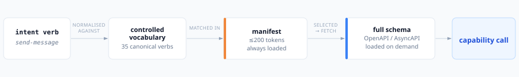
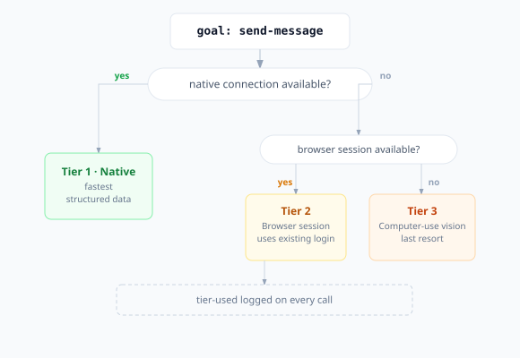
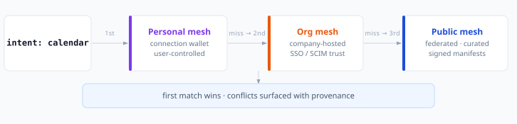

# Architecture frictions and how Ferridis resolves them

Three tensions surfaced when combining the six layers of Ferridis. Each one is real; each one needed an explicit resolution before the architecture could be written down. This document is the record of those decisions and the reasoning behind them.

## 1. Intent routing vs. lazy capability loading

**The tension.** The intent layer takes a high-level goal — *"tell Alice I'll be late"* — and picks the right capability to fulfill it. But lazy loading means the full schemas of capabilities aren't loaded into the model's context until they're needed. So how does the router pick a capability when it can't see what each one does?

**The resolution: two-stage capability advertisement.** Every capability publishes two artifacts:

1. A **manifest** — small, always loaded into the resolver's working set. Contains: ID, name, category, supported intent verbs, one-line summary, schema URL, supported execution tiers, auth method. Hard size cap (≈200 tokens of meaningful content) to enforce clarity.
2. A **schema** — full OpenAPI 3 or AsyncAPI spec. Loaded on demand only when the capability is actually selected for a call.

The intent router operates on manifests. It uses the controlled intent vocabulary plus the summary to disambiguate. Once a capability is chosen, the schema loads and the call is made.

This is the same shape as DNS (small SOA/NS records, full data on resolve) or npm (lightweight package metadata, full tarball on install). It works because the registry maintains a controlled vocabulary of intent verbs — and that vocabulary is where the protocol's curation labour goes.

**Trade-off accepted.** The mesh has to maintain a controlled intent vocabulary. This is real ongoing work, but it is also where the protocol's quality lives — precise verbs make for precise routing. We treat the vocabulary as a first-class artifact, governed openly.

## 2. Browser fallback vs. native capability precedence

**The tension.** A user might have a native Gmail connection *and* a logged-in Gmail browser tab *and* the option to drive Gmail visually with computer-use. Three execution paths exist for the same goal. Which one runs?

**The resolution: a declared tier preference, user-overridable.**

Default precedence:

1. **Native connection** — fastest, structured data, lowest cost. Use when available and the task's data shape is known.
2. **Browser session** — slower, less structured, but uses the user's existing login. Use when no native connection exists, or the task is inherently UI-driven (clicking through a flow).
3. **Computer-use vision** — last resort. Use when no API and no DOM access works (legacy desktop apps, locked-down enterprise software).

Each connection's manifest declares which tiers it supports. The runtime picks the highest-precedence tier the connection supports. The user can override per-service — *"always use the browser for this internal tool because the API is incomplete."*

Every call logs which tier was used. Debugging is opaque if you can't see whether a failure happened in an API call or a click sequence.

**Trade-off accepted.** A precedence ladder adds complexity, mitigated by surfacing the chosen tier in every call log so users can see and override.

## 3. Federated public registry vs. private connections

**The tension.** A federated mesh works for public services everyone uses — Gmail, Calendar, Slack. But users also have private connections: a company's internal tools, a personal home server, a one-off connection that should never be public. Those can't live in a public registry, but they still need to be discoverable to the right user.

**The resolution: a three-tier registry model.**

1. **Public mesh** — federated, curated, governed. Anyone can publish through quality gates (signed manifests, capability tests, identity verification). Used for popular services. Think npm registry or Docker Hub, but for AI capabilities.
2. **Organization mesh** — private to a company, hosted on the company's own infrastructure or a managed plane. Used for internal tools. Trust inherited from corporate identity (SSO, SCIM).
3. **Personal mesh** — per-user, lives in the user's connection wallet on their own device. Used for self-hosted services and one-off connections.

When the AI resolves a category like *"calendar,"* the resolver queries personal → org → public, in that order. First match wins. Conflicts surface to the user with provenance.

This matches developer mental models from Docker (Hub + private registry), Maven (Central + corporate Nexus + local), and npm (registry + private scopes). Familiarity is a feature, not a coincidence.

**Trade-off accepted.** Three governance layers to think about — but each is well-precedented and the per-tier semantics are clean.

---

These three resolutions unblock the architecture document. Each is recorded here so the rationale outlives the decision.
