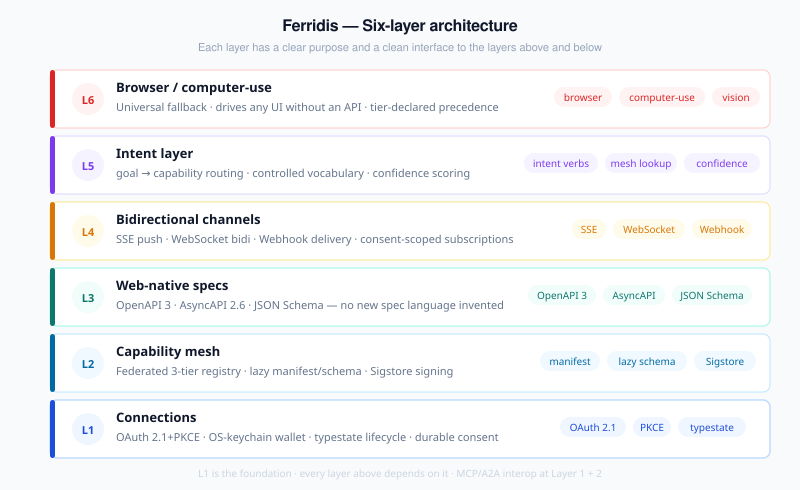
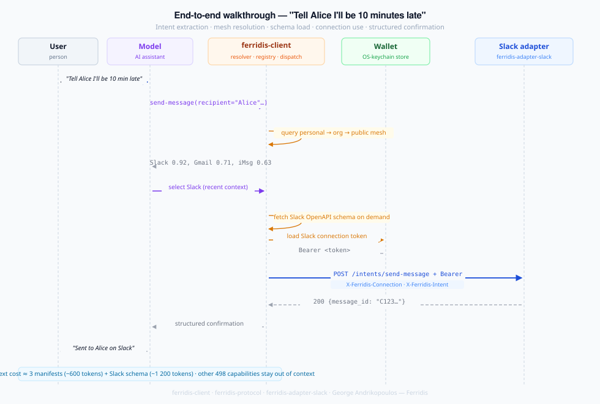

# Ferridis architecture

*An opinionated, type-driven design layer above the wire protocols that connect AI to the world the user already lives in.*

## Executive summary

Ferridis is a **connection-and-mesh** design for the experience layer above the MCP/A2A wire standard. Users authorize *connections* — durable, consent-based links to services — instead of installing and running server processes. Capabilities are discovered through a **federated mesh** with lazy-loaded schemas. Events flow back from the world over **bidirectional channels**. An **intent layer** routes high-level goals to the right capability. The **browser** stays as a universal fallback for anything not yet wired up.

The user sees one thing: *I connected my calendar. The assistant uses it.*

## Relationship to MCP, A2A, and AAIF

The wire-level standard for connecting AI to tools is now governed under the **Agentic AI Foundation** (AAIF), a Linux Foundation directed fund co-founded by Anthropic, Block, and OpenAI in December 2025. **MCP** is the standard for agent-to-tool calls, with active SEP-based evolution and 170+ member organizations. **A2A** is Google's open standard for agent-to-agent communication — a complementary protocol in the same ecosystem, not an AAIF project.

Ferridis is not a wire-protocol proposal. The standards above already cover request/response framing, capability invocation, and basic discovery. What those standards deliberately leave to implementers is everything *around* the wire: how connections are authorized and stored, how the user discovers what's available without their model's context being flooded with schemas, how high-level intents are routed to specific capabilities, and what happens when the integration target has no API at all.

Those are the layers Ferridis takes opinions on. Concretely:

- **Connections, not servers**, as the user-facing metaphor — borrowed from how phone apps work.
- **Two-stage advertisement** — small always-loaded manifest, full schema on demand — so the model's context cost stays bounded as the connected world grows.
- **Three-tier federated registry** (personal → org → public) with explicit precedence and conflict surfacing.
- **A controlled intent vocabulary** so high-level goals route to the right capability without the model memorising 500 tool descriptions.
- **Browser/computer-use as tier 3** of the same protocol, not a separate product.
- **A type-driven Rust reference** with typestate and illegal-states-unrepresentable, complementing the existing TypeScript and Python MCP references.

MCP/A2A interoperability ships in both directions in the reference implementation: `ferridis-mcp-server` publishes Ferridis-connected capabilities as MCP tools for any MCP-aware client (Claude Code, Zed, Cursor, MCP-supporting Copilot), and `ferridis-client::mcp` consumes MCP servers as `Tier::Native` Ferridis capabilities over both stdio and SSE.

## Design principles

Five principles, in priority order. When two conflict, higher beats lower.

1. **Hide the wires.** The user never edits a config file, runs a server, or debugs a JSON-RPC error. Configuration is OAuth-grade simple.
2. **Be web-native.** Reuse OAuth, OpenAPI, AsyncAPI, JSON Schema, HTTP. Invent nothing the web has already standardized.
3. **Lazy by default.** Nothing loads into the model's context until it's needed. The default state of every capability is "discoverable but absent."
4. **Composable and federated.** No central authority owns the namespace. Public, organizational, and personal capabilities coexist.
5. **Attribution is structural.** Every capability declares its author, license, and provenance. The protocol carries this through to the user.

## The six layers

Ferridis is a stack. Each layer has a clear purpose and a clear interface to the layers above and below.



### Layer 1 — Connections

A **connection** is a durable, consent-based link between a Ferridis runtime (e.g., an AI assistant) and a service (e.g., Google Calendar).

**What it carries:** the identity of the user, the scope of access, refresh credentials, an audit trail, and lifecycle metadata (created, last used, expiry).

**How it's established:** standard OAuth 2.1 (or OAuth 2.0 with PKCE). The runtime opens a browser window, the user grants the requested scopes on the service's own consent screen, and the resulting tokens land in the user's **connection wallet** — a local, encrypted store on the user's device.

**Consent model:** every connection lists exactly the intents and capability scopes it grants. Granular revocation is first-class: users can revoke a single connection without affecting others.

**Why this matters.** The install-a-server-per-tool experience leaves credential storage and scope to each server, which means every adapter reinvents identity. Ferridis takes the opposite position: identity is a solved problem at the web layer, use OAuth, and bind the result to a durable user-owned connection.

### Layer 2 — Capability mesh

A **capability** is something the world can do for the AI: read a calendar, send a message, query a database, render a document. The **mesh** is how capabilities are discovered.

**Two-stage advertisement:**

- **Manifest** (always loaded): ≈200-token summary with ID, category, intent verbs, one-line description, schema URL, supported execution tiers.
- **Schema** (loaded on demand): full OpenAPI 3 or AsyncAPI spec.

**Three-tier registry:**

| Tier | Scope | Trust source | Examples |
|---|---|---|---|
| Public | Federated, curated | Quality gates, signed manifests | Gmail, Calendar, Slack, Notion |
| Organization | Private to a company | Corporate SSO/SCIM | Internal tools, company wikis |
| Personal | Per-user wallet | User-controlled | Home server, one-off API |

The resolver searches personal → org → public, first match wins, conflicts surfaced with provenance.

### Local discovery broker

The reference implementation ships a **discovery broker** (`ferridis-discovery-broker`, HTTP on `127.0.0.1:7825`) as a process-local service registry that bridges "a service is running" and "the client knows it exists."

**Two registration lifetimes — modelled as an exhaustive enum, not a boolean:**

```rust
enum Lifetime {
    Ephemeral { expires_at: Instant },  // expires after DEFAULT_TTL (300 s) unless refreshed
    Pinned,                              // bypasses TTL; survives process restarts
}
```

Using `Lifetime` rather than `pinned: bool` follows the type-driven discipline (Pattern 5 — exhaustive enums over booleans): an entry is either ephemeral or pinned and neither state can be confused with the other at the type level.

**Wire surface:**

| Endpoint | Purpose |
|---|---|
| `POST /discovery/register` | Register or refresh. Body: `{name, kind, url, persistent?}`. Omitting `persistent` → ephemeral. Backwards-compatible. |
| `GET /discovery/services` | Live snapshot. Each entry includes `"persistent": bool`. |
| `GET /discovery/events` | SSE push stream — fires on every new `POST /register`. |
| `DELETE /discovery/services/{name}` | Remove and atomically persist. Returns 204 (removed) or 404 (not found). |

**Persistence contract:** only pinned entries are written to the state file (`~/.local/share/ferridis/discovery.json`). Ephemeral entries expire naturally and are never revived on restart. Loaded entries are always treated as `Lifetime::Pinned` — being in the state file implies the operator intended the service to survive restarts.

**Broker ↔ client integration:** `Client::discover_broker(url)` fetches the initial snapshot synchronously before returning, so callers can build their tool catalogue immediately. It then subscribes to `GET /discovery/events` in the background and auto-registers new MCP arrivals. `ferridis-mcp-server` activates this subscription at startup when given `--discovery-broker http://127.0.0.1:7825`. The SSE deduplication is intentionally silent — re-registering an already-known service is a no-op.

**Resolved gaps (as of v0.6):**

- **Adapter self-registration** — `ferridis-adapter-sdk::broker` provides a `BrokerRegistration` RAII handle (heartbeat 240 s, abort-on-drop). Adapters call `BrokerRegistration::register(broker_url, ...)` at startup with no manual POST required.
- **stdio MCP bridging** — `ferridis-stdio-bridge` wraps any stdio process and exposes it as an SSE endpoint the broker can register. See [open questions](#open-questions) for remaining governance and vocabulary items.
- mDNS (`_mcp._tcp.local`, `_ferridis._tcp.local`) is scanned but nothing on the network currently advertises on those service types — low priority until the public mesh has real participants.

### Layer 3 — Web-native specs

No new spec language. Capabilities describe themselves in **OpenAPI 3** (request/response shape) or **AsyncAPI** (event-driven). Schemas are validated with **JSON Schema**.

**Why this matters.** Every modern service already publishes one of these, or can with minimal effort. Ferridis becomes a thin layer over existing tooling instead of yet another spec to learn.

### Layer 4 — Bidirectional channels

Request/response gets you call-and-wait. Reactive agents need the world to push back — *the build broke, the email arrived, the calendar event is ten minutes out.* Ferridis treats **push** as first-class, with a consent model that lives at the same level as the connection itself rather than being bolted on per adapter.

**Mechanisms:**

- **Server-Sent Events** for one-way `server → client` push from a connection — the lower-overhead default for pure push channels.
- **WebSockets** for bidirectional channels — subscription management, acknowledgments, and capability-specific control messages travelling upstream alongside the event stream coming down. Both transports share the same `ServerEvent` shape downstream, so consumer code is transport-agnostic.
- **Webhooks** for high-volume, asynchronous events where the runtime cannot keep a long-lived connection open.
- **Manifest-declared event channels** name the channels a capability emits on (one entry per channel, optional `chunk_schema_url`), so the runtime can subscribe only to declared channels and consent maps cleanly onto the names.

**Use cases.** *"Tell me when a high-priority email arrives." "Notify me if the build breaks." "Wake up when my calendar event is in 10 minutes."*

**Consent boundary.** Event subscriptions require the same explicit user consent as the initial connection — and a separate, easily-revocable scope.

### Layer 5 — Intent layer

The intent layer turns goals into capability calls.

**Input:** a structured intent — a verb plus arguments. Example: `send-message(recipient: "Alice", body: "I'll be late")`.

**Process:**

1. Normalize verb against the controlled intent vocabulary.
2. Match against manifests in the mesh (personal → org → public).
3. Surface candidates to the model with confidence scores.
4. Model picks one (or asks the user if ambiguous).
5. Schema for the chosen capability loads on demand.
6. Call executes through the Layer 1 connection.

**Why this matters.** The model doesn't have to memorize 500 tool descriptions. It works at the level of intents; the mesh handles the lookup.

### Layer 6 — Browser / computer-use fallback

Some capabilities will never be wired up natively — legacy enterprise apps, niche internal tools, services without public APIs. For these, the **browser session** and **computer-use vision** are universal escape hatches.

A connection's manifest declares supported tiers (`["native"]`, `["browser"]`, `["browser", "vision"]`, etc.). The runtime picks the highest-precedence supported tier.

**Why this matters.** Ferridis ships useful from day one — even for services that haven't published a manifest yet, the AI can drive them visually if a logged-in browser exists.

### Sub-layer: agent-driving adapters

A specialised case of tier-1 (Native) capabilities: adapters that wrap **other AI agents** as Ferridis capabilities. The reference implementation ships `ferridis-adapter-claude-cli`, which exposes the Claude Code CLI as a stream-kind capability so any Ferridis client (or any MCP-aware host via `ferridis-mcp-server`) can drive a non-interactive Claude Code session — `submit-prompt` to start, `resume-session` to continue by id.

This category exists because editor agent panels (Zed's, Cursor's, others) don't yet expose a public extension API for the active assistant session. Wrapping the CLI is the realistic path to "remote-control Claude Code today"; when editor panels grow a control surface, a thinner adapter can replace this one with the rest of the Ferridis stack unchanged.

## End-to-end walkthrough

User says: *"Tell Alice I'll be 10 minutes late to our 3pm meeting."*

1. **Intent extraction.** The model emits `send-message(recipient: "Alice", body: "Running 10 minutes late, see you soon", relates_to: "today's 3pm meeting")`.
2. **Mesh resolution.** Resolver queries personal → org → public for capabilities supporting `send-message`. Finds three candidates: Slack, Gmail, iMessage. Surfaces all three with confidence scores.
3. **Disambiguation.** Model checks recent context: the most recent communications with Alice are on Slack. Picks Slack.
4. **Schema load.** Slack's full OpenAPI schema for `chat.postMessage` loads on demand.
5. **Connection use.** Runtime fetches the user's Slack connection from the wallet, calls `chat.postMessage` with the bound credential.
6. **Confirmation.** Slack returns a message ID. Runtime emits a structured confirmation to the model and a human-readable status to the user.

Total context cost to the model: the manifests of the three candidate capabilities (~600 tokens) plus the chosen schema (~1200 tokens). The other ~498 capabilities the user has connected are not in context.




## What Ferridis adds on top of the wire standard

MCP defines the wire-level call. Ferridis adds an opinionated layer above it. The table below shows what those opinions look like — and where each opinion lives in this document — so contributors can see the boundary clearly.

| Dimension | Wire standard (MCP) | Ferridis layer above |
|---|---|---|
| Integration unit | Server process | Connection — an OAuth grant in the user's wallet (Layer 1) |
| User-facing model | Install / configure / run | Authorize once (Layer 1) |
| Discovery | Out of scope at the wire level | Federated three-tier mesh, personal → org → public (Layer 2) |
| Context cost | Full schema in context per tool | Two-stage advertisement: manifest always, schema on demand (Layer 2) |
| Auth | Per-server | OAuth 2.1 / 2.0+PKCE everywhere (Layer 1) |
| Event push | Implementation-defined | First-class bidirectional channels with consent scope (Layer 4) |
| Fallback path | Not defined | Browser + computer-use as tier 3 of the same protocol (Layer 6) |
| Trust model | Per-server | Three-tier registry with signed manifests and provenance surfacing (Layer 2) |
| Spec language | JSON-RPC over MCP transports | OpenAPI 3 / AsyncAPI 2.6+ at the manifest's `schema.url` (Layer 3) |
| Composition | Caller composes | Intent layer routes goals across capabilities (Layer 5) |
| Reference implementation | TypeScript, Python | Rust, with typestate + illegal-states-unrepresentable |

None of these displace MCP. They are the opinions Ferridis takes on top of it.

## Resolved frictions

Three design tensions were worked through before this document was written. Brief summary:

1. **Intent vs. lazy loading** → two-stage manifest/schema advertisement.
2. **Browser vs. native precedence** → declared tier preference, user-overridable.
3. **Public vs. private registry** → three-tier mesh (personal/org/public).

Full record: [architecture-frictions.md](./architecture-frictions.md).

## Open questions

Design tensions that remain unresolved:

- **Intent vocabulary governance.** Drafted in [`vocabulary.md`](./vocabulary.md) (35 verbs across 8 categories) and proposed for AAIF. Until AAIF accepts (or refers elsewhere), George maintains. The most important governance question in the project remains *which body owns the namespace long-term*.
- **Cross-capability transactions.** What happens when an intent needs two capabilities atomically (e.g., "move this email to a folder *and* archive the calendar event it created")? Out of scope for v0.x, important for v1.
- **Local capability execution.** Connections that run locally (a script on the user's machine) need a different trust model than remote ones. Sketched but not specified.
- **CT log validation.** CRL-based revocation ships in v0.6; Certificate Transparency log verification (checking that the signing cert appears in a CT log) is not yet implemented. Lower urgency since Rekor already provides an append-only inclusion proof.

## Resolved since v0.1

Answers to questions that were open in earlier revisions:

- **Manifest signing.** Sigstore (cosign-bundle JSON). Full trust chain — sig-vs-cert + cert window + Rekor inclusion proof + Fulcio chain via `rustls-webpki` + CRL revocation check. Ships in `ferridis-protocol::signing`. `TrustRoot::from_sigstore_tuf` auto-fetches trust material from Sigstore's Public Good TUF repo.
- **Streaming responses.** Manifest declares per-intent `kind: "request" | "stream"` plus `chunk_schema_url`; wire transport reuses SSE; consumer API is `Client::dispatch_streaming -> Pin<Box<dyn Stream<Item = …>>>`.
- **Bidirectional event channels.** WebSocket primitive in `ferridis-protocol::ws` with typed `ClientMessage` (`Subscribe` / `Unsubscribe` / `Ack` / `Control`) upstream and reused `ServerEvent` downstream.
- **Adapter self-registration.** `ferridis-adapter-sdk::broker` ships a `BrokerRegistration` RAII handle with 240 s heartbeat — adapters call it at startup, no manual POST required. (v0.6)
- **stdio MCP bridging.** `ferridis-stdio-bridge` wraps any stdio MCP server as an HTTP SSE endpoint the broker can register. Deployed to handle tools like `linux-health-mcp` that have no network URL. (v0.6)
- **Cert revocation.** CRL-based revocation check against the CDP extension in the signing cert. `RevocationMode::BestEffort | Required | Skip` is caller-configurable. CT log verification deferred (see open questions). (v0.6)

---

## Workspace code architecture

Everything above describes the *protocol*. This section describes the *Rust workspace* that implements it — crate topology, parsing boundaries, and the decisions log. (It lives in this file rather than a separate `ARCHITECTURE.md` because the repository must build on case-insensitive filesystems, where the two names collide.)

### Crate topology

Fourteen crates in `rust/crates/`, layered strictly — a crate depends only on crates in the rows above it:

| Layer | Crates | Role |
|---|---|---|
| Types | `ferridis-core` | Pure types, no I/O. Typestate `Connection<S>`, parse-don't-validate `Manifest`, validated `IntentVerb` / `Tier` / `Tiers` / `AccessToken`, `IntentKind`, `EventChannel`, `ChannelTransport`. |
| Wire | `ferridis-protocol` | HTTP transport, OAuth 2.0+PKCE, manifest/schema fetch, mesh + federated mesh + signed mesh-index, Sigstore trust chain (TUF auto-fetch, CRL revocation), SSE events + streaming, WebSocket bidi, mDNS scanning. |
| Frameworks | `ferridis-adapter-sdk` (publisher), `ferridis-client` (consumer) | SDK: `Capability` trait, axum `AdapterServer`, kind-aware routing, request validation, `WsHandler`, event publishing, broker self-registration. Client: keychain wallet, three-tier registry, intent matching, auth-aware + streaming dispatch, schema validation, MCP-consumer module, mesh/broker/mDNS registration. |
| Adapters | `ferridis-adapter-fs`, `-claude-cli`, `-google-calendar`, `-slack`, `-github`, `-notion` | Reference publishers. Each embeds its manifest and implements `Capability` (and `dispatch_stream` where stream-kind). |
| Binaries | `ferridis-cli`, `ferridis-mcp-server`, `ferridis-discovery-broker`, `ferridis-stdio-bridge` | Sidecar (JSON-RPC over stdio), MCP-publisher shim, local service registry (port 7825), stdio-MCP-to-SSE bridge (port 7826). |

Default adapter ports: fs 7821, claude-cli 7823, github 7827, google-calendar 7828, slack 7829, notion 7830.

### Parsing boundaries

Every external input is parsed into a witness type at exactly one perimeter; interior code takes witnesses and never re-checks:

- **JSON off the wire** → `serde(try_from = "String")` on every validated newtype (`IntentVerb`, `Category`, `Summary`, `CapabilityVersion`, `CapabilityRef`). Deserialization *is* the validating constructor.
- **Manifests** → parsed on receipt in `ferridis-protocol::manifest`; everything downstream assumes validity.
- **Connection lifecycle** → typestate `Connection<Pending | Authorized | Expired | Revoked>`; transitions consume `self`. Reconstruction from storage goes through `pub(crate)` ctors inside `ferridis-core` only.
- **Filesystem paths** (fs adapter) → `Root` / `RelPath` typestate; a path that escapes the root is unrepresentable.
- **Claude CLI inputs** → `Prompt`, `AllowedCwd`, allow-list-gated `Model`, UUID-validated `SessionId` at the dispatch boundary.
- **Secrets** → `AccessToken` with redacted `Debug`; wallet entries live in the OS keychain, never plaintext.
- **Request bodies** → validated twice by design: client-side against `input_schemas[intent]`, adapter-side via `Capability::body_schema` (the adapter is the final validator).

Workspace-wide discipline: no `unsafe`, `#![deny(missing_docs)]` on every public crate, clippy clean with `-D warnings`, toolchain pinned 1.95.0 / Edition 2024. [FEATURES.md](./FEATURES.md) records the enforcing artifact (type or test) for every shipped feature.

### Decisions log (append-only)

New entries go at the bottom with date, decision, why, and what was rejected. Never rewrite old entries.

| Date | Decision | Why | Rejected alternatives |
|---|---|---|---|
| v0.1 | Rust, Edition 2024, MSRV 1.95, toolchain pinned | Protocol-grade compile-time guarantees; reproducible builds | TypeScript/Python-style references (weaker guarantees) |
| v0.1 | `rustls` everywhere, no OpenSSL | Portable builds, no system-dependency footgun | OpenSSL linkage |
| v0.1 | HTTP pool hardening (`pool_idle_timeout` 15 s, `pool_max_idle_per_host` 2, `connect_timeout` 5 s) | Stale localhost keepalives survived adapter restarts and wedged calls (hit in the Task 11 demo) | Default reqwest pool settings |
| 2026-05-11 | OS keychain wallet; **refuse to run** without a backend; refuse legacy plaintext wallets | A silent plaintext fallback is a downgrade vector; explicit `FERRIDIS_WALLET_MEMORY=1` is the only escape hatch | Plaintext fallback with a warning |
| 2026-05-11 | `serde(try_from = "String")` on validated newtypes | `serde(transparent)` silently bypassed the validating constructors | Keeping transparent + re-validating later (scattered checks) |
| 2026-05-11 | Publisher registers adapters partial-failure-tolerant, 10 s per-adapter timeout; `tools/list` advertises the working subset only | All-or-nothing stalled startup on one dead host; a tool guaranteed to fail is worse UX than one that isn't there | Error-placeholder tools; unbounded TCP connect window |
| 2026-05-11 | MCP `inputSchema` preserved verbatim through the projection | Typed args (integer `limit`) must round-trip; regenerated schemas are lossy | Hardcoded per-tool schema tables as the primary source |
| 2026-05-12 | **Sigstore** (cosign + Fulcio + Rekor) for manifest signing | Web-native, keyless, existing transparency log — reuse, don't invent key distribution | Bare Ed25519 publisher keys; self-managed X.509 |
| 2026-05-12 | Streamed intents must declare `chunk_schema_url` (validation error otherwise) | A silent default is a footgun for chunk-validating clients | Optional field with an implicit any-schema |
| 2026-05-12 | MCP SSE session-loss auto-recovery: typed `McpSessionExpired`, `reconnect()` + replayed `initialize`, retry exactly once | Server restarts left long-running consumers POSTing to dead sessions with no recovery path | Failing the call and requiring a host restart |
| 2026-05-13 | Publisher branches on `intent_kind()`: stream-kind collects chunks via `dispatch_streaming`, returns final result + chunk array | MCP 2024-11-05 hosts expect a single response; progressive forwarding waits for notifications-as-chunks | Rejecting stream-kind tools from the publisher |
| 2026-05-23 | `Lifetime` enum (`Ephemeral { expires_at }` \| `Pinned`) in the discovery broker, replacing a `persistent: bool` | The bool + TTL pair could disagree — illegal states unrepresentable instead; state file stores only pinned entries | Boolean flag beside an expiry field |
| 2026-05-24 | `RevocationMode { BestEffort \| Required \| Skip }` for Sigstore verification, default `BestEffort` | CRL endpoints are flaky; callers choose strictness explicitly | Hard-required CRL (breaks offline use); silent skip |
| 2026-07-20 | This section + decisions log added; FEATURES.md converted to an enforced-by ledger | Context files fail two ways — staleness and unenforced guarantees; the ledger and log exist to kill both | Feature matrix without enforcing artifacts (status quo) |
| 2026-07-20 | Backpressure wire shape: separate `event: backpressure {"signal": …}` emitted on state *change*; `Halt` terminates the stream with no trailing `end`; SDK entry point is `Capability::dispatch_stream_flow` with a default that adapts `dispatch_stream` | Additive on the wire (pre-v0.7 clients ignore unknown SSE events) and additive in the API (existing adapters compile and behave identically); halt-as-terminator keeps "deliberate stop" distinguishable from both clean `end` and dropped connection | Embedding the signal inside each `chunk` payload (breaks the chunk shape for old clients); changing `IntentStream`'s item type (breaks every existing adapter) |
| 2026-07-20 | Stream cancellation stays connection-scoped: consumer drop closes the HTTP connection, the SDK drops the adapter's intent stream, and resource cleanup rides `Drop` (`kill_on_drop` children etc.) — no explicit cancel message on the SSE path | SSE is one-way; the connection close *is* the cancel signal, and Rust's `Drop` makes the cleanup guarantee compile-time-structural rather than protocol-dependent. Enforced by `consumer_drop_reaches_the_adapter_stream_drop`. | An out-of-band `DELETE /intents/...` cancel endpoint (second code path to keep consistent; the WS transport's typed `Unsubscribe` already covers the bidi case) |
