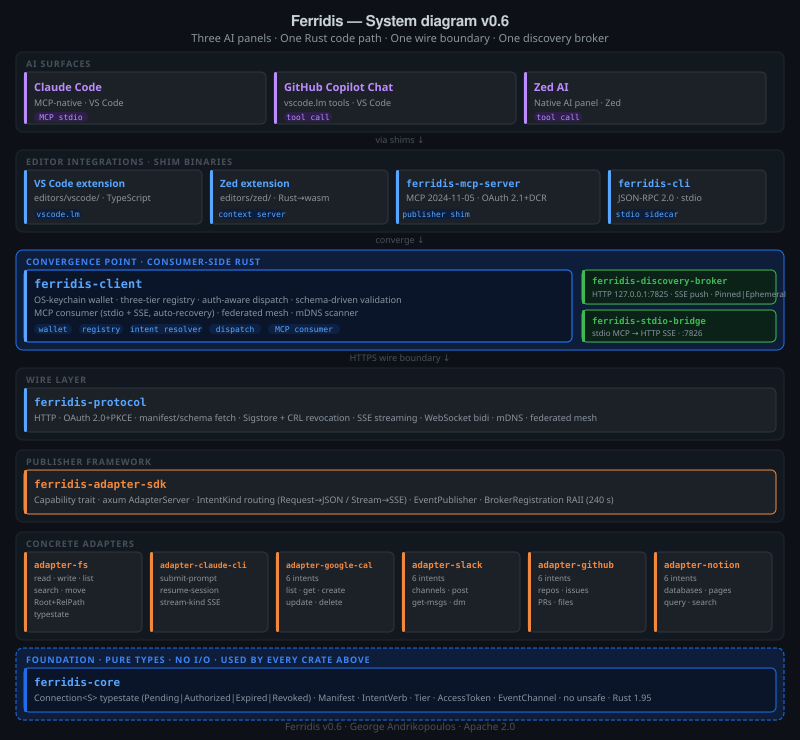

# System diagram — Ferridis v0.6

*Three AI panels. One Rust code path. One wire boundary. One discovery broker.*

This diagram shows how three different AI assistants — Claude Code, GitHub Copilot Chat, and Zed AI — reach the same Rust code path through different shim binaries, all converging at `ferridis-client` and then crossing one HTTPS wire boundary to the adapter layer. A local discovery broker (port 7825) sits alongside, advertising live services to the client via SSE push. Adapters self-register on startup via the broker SDK RAII handle.

## Reading the diagram

**Three surfaces, one library.** Each AI assistant reaches Ferridis through a different transport (Claude Code via MCP stdio, Copilot via VS Code's `vscode.lm` tools, Zed via its native context-server protocol). All three paths converge at **`ferridis-client`** — the same Rust library, with the same wallet, the same manifest registry, and the same auth-aware dispatch logic. Whatever surface the user interacts with, the code path that does the work is identical.

**One wire boundary.** Below `ferridis-protocol`, every call goes out over HTTPS with the same advisory headers (`X-Ferridis-Connection`, `X-Ferridis-Intent`). The publisher side (SDK + concrete adapter) has no knowledge of which AI panel originated the call. This is what "adapters are plugins via the wire protocol" looks like in practice — anyone who can speak this HTTP contract is a Ferridis adapter, regardless of language.

**Self-registering adapters.** Each adapter carries a `BrokerRegistration` RAII handle (240 s heartbeat, abort-on-drop) from `ferridis-adapter-sdk::broker`. On startup, adapters call `register()` and the broker immediately advertises them to connected clients via SSE push — no manual POST required. `ferridis-stdio-bridge` provides the same path for stdio-only MCP servers that have no native network URL.

**Type-driven from top to bottom.** `ferridis-core` is at the foundation because every other crate depends on its types: the typestate `Connection<S>` (lifecycle correctness), the parse-don't-validate `Manifest` (illegal manifests unrepresentable), the validated `IntentVerb` and `Tier`, the redacted `AccessToken`. The discipline applied in `ferridis-core` propagates upward through every crate.

**Signed trust chain.** `ferridis-protocol` verifies the mesh index and individual manifests through the full Sigstore trust chain: sig-vs-cert + cert validity window + Rekor inclusion proof + Fulcio chain validation + CRL revocation check against the signing cert's CDP extension.

## The path of one call

When the user asks Claude Code in VS Code to read a file via Ferridis:

1. **Claude Code** sends an MCP `tools/call` over stdio to **`ferridis-mcp-server`**.
2. **`ferridis-mcp-server`** maps the MCP tool name to a Ferridis intent verb and asks **`ferridis-client`** to dispatch.
3. **`ferridis-client`** looks up the capability's manifest in its registry, pulls the connection (if needed) from the wallet, and asks **`ferridis-protocol`** to make the call.
4. **`ferridis-protocol`** sends an HTTPS request with the advisory Ferridis headers across the wire.
5. **`ferridis-adapter-sdk`** receives the request in the adapter's axum server, validates that the intent is declared in the manifest, and dispatches into the `Capability` impl.
6. **`ferridis-adapter-fs`** translates the intent into a filesystem read, with `RelPath` enforcing that the path cannot escape `Root`.
7. The response travels back up the same stack.

The same flow runs for Copilot and Zed; the only difference is which shim binary sits between the AI panel and `ferridis-client`.
