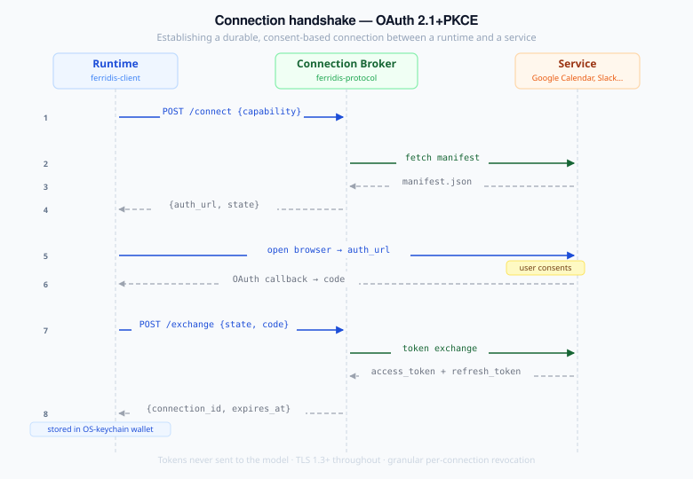

# Ferridis wire protocol (v0 sketch)

*Concrete protocol detail, illustrative not normative. The architecture document is the contract; this is one plausible implementation of it.*

## Goals

- **Web-native.** HTTP over TLS, JSON, OAuth — nothing exotic.
- **Self-describing.** Capabilities advertise themselves; runtimes can discover and use them without prior knowledge.
- **Lazy.** Nothing more than necessary loaded into model context.
- **Versioned.** Forward and backward compatibility via explicit version negotiation.

## URL scheme

Capabilities are addressed with the `ferridis://` scheme:

```
ferridis://<registry-host>/<namespace>/<capability-id>@<version>
```

Examples:

```
ferridis://public.ferridis.io/google/calendar@v3
ferridis://acme-corp.internal/payroll/lookup@v1
ferridis://wallet/local/home-server/lights@v1
```

The registry host determines the tier (public, organization, or personal-wallet).

## Connection handshake

Establishing a connection between a runtime and a service:



The connection broker is a Ferridis-protocol component — it can be runtime-local or hosted. It handles OAuth on behalf of the runtime, stores the resulting tokens in the user's connection wallet, and returns an opaque connection ID the runtime uses for subsequent calls.

## Manifest format

Every capability publishes a manifest at `<capability-url>/manifest.json`.

```json
{
  "ferridis_version": "0.1",
  "id": "google.calendar.v3",
  "name": "Google Calendar",
  "category": "calendar",
  "summary": "Read events, find availability, create and update events in Google Calendar.",
  "intents": [
    "read-events",
    "create-event",
    "update-event",
    "delete-event",
    "find-time"
  ],
  "schema": {
    "type": "openapi-3",
    "url": "https://calendar.googleapis.com/$discovery/rest?version=v3"
  },
  "events": {
    "type": "asyncapi",
    "url": "ferridis://public.ferridis.io/google/calendar@v3/events.yaml"
  },
  "tiers": ["native", "browser"],
  "auth": {
    "type": "oauth2",
    "scopes": ["https://www.googleapis.com/auth/calendar"]
  },
  "publisher": {
    "name": "Ferridis Public Mesh",
    "verified": true,
    "signature": "..."
  },
  "license": "Apache-2.0"
}
```

Manifest size budget: ≤200 tokens of meaningful text content (excluding signatures and URLs). The intent router operates on this surface.

## Capability schema

Loaded on demand from the URL declared in the manifest. Standard OpenAPI 3 or AsyncAPI 2.6+. No Ferridis-specific extensions are required, though the mesh registry may layer provenance metadata.

## Call invocation

Once a capability is selected, calls go directly to the service over standard HTTPS, with the connection's bound token in the `Authorization` header:

```http
POST https://www.googleapis.com/calendar/v3/calendars/primary/events
Authorization: Bearer <token-from-connection>
X-Ferridis-Connection: <connection_id>
X-Ferridis-Intent: create-event
Content-Type: application/json

{
  "summary": "Coffee with Alice",
  "start": {"dateTime": "2026-05-12T15:00:00Z"},
  "end":   {"dateTime": "2026-05-12T15:30:00Z"}
}
```

The `X-Ferridis-Connection` and `X-Ferridis-Intent` headers are advisory: services that haven't adopted Ferridis yet still work, since the call is just standard OAuth-bearer HTTP. Services that *have* adopted Ferridis can use the headers for telemetry, billing scope, or rate-limit isolation.

## Event subscription

Capabilities declare named event channels in the manifest:

```jsonc
{
  "event_channels": [
    { "name": "state-changed" },
    { "name": "service-called", "chunk_schema_url": "https://x/svc.json" }
  ]
}
```

Channel names use the same character class as intent verbs (lowercase ASCII, digits, dashes). Each channel's wire URL is `{endpoint_url}/events/{name}` by convention; clients reject subscriptions to undeclared channels with a typed `EventChannelNotDeclared` error.

### SSE — one-way push (server → client)

The default transport for pure-push channels. The runtime opens a long-lived SSE connection and consumes typed `ServerEvent`s:

```http
GET /events/state-changed HTTP/1.1
Accept: text/event-stream
Authorization: Bearer <connection-bearer-or-runtime-token>
```

```http
HTTP/1.1 200 OK
Content-Type: text/event-stream

event: state-changed
id: 42
data: {"entity_id":"light.kitchen","state":"on"}

event: state-changed
id: 43
data: {"entity_id":"light.kitchen","state":"off"}
```

### WebSocket — bidirectional channels

When a channel needs upstream traffic — subscription management, acknowledgments, capability-specific control — the wire upgrades to WebSocket:

```http
GET /events/state-changed HTTP/1.1
Upgrade: websocket
Connection: Upgrade
Authorization: Bearer <connection-bearer-or-runtime-token>
Sec-WebSocket-Key: …
Sec-WebSocket-Version: 13
```

Frames are text (JSON only — binary frames are rejected). Downstream frames carry `ServerEvent` in the same shape as SSE. Upstream frames carry a typed `ClientMessage`:

```jsonc
{ "type": "subscribe",   "channel": "state-changed" }
{ "type": "unsubscribe", "channel": "state-changed" }
{ "type": "ack",         "id": "42" }
{ "type": "control",     "payload": { /* capability-defined */ } }
```

Server picks SSE or WebSocket per channel based on whether it needs the upstream surface. The manifest `transport: "sse" | "ws"` hint per channel shipped in v0.4; the runtime probes WebSocket first and falls back to SSE on upgrade failure.

## Discovery / mesh resolution

A runtime resolves an intent against the mesh:

```http
POST ferridis://public.ferridis.io/resolve
Content-Type: application/json

{
  "intent": "send-message",
  "context": {
    "recipient_hint": "Alice",
    "user_locale": "en-GB"
  },
  "limit": 5
}
```

Response:

```json
{
  "candidates": [
    {
      "capability": "ferridis://public.ferridis.io/slack/messaging@v2",
      "confidence": 0.92,
      "manifest": { /* full manifest */ }
    },
    {
      "capability": "ferridis://public.ferridis.io/google/gmail@v1",
      "confidence": 0.71,
      "manifest": { /* full manifest */ }
    }
  ]
}
```

Resolution against personal and organization meshes follows the same shape against different hosts. The runtime is responsible for merging the three result sets in personal → org → public order.

## Error model

Standard HTTP status codes. Ferridis-level errors are returned with a structured body:

```json
{
  "ferridis_error": {
    "code": "connection_expired",
    "message": "The connection token has expired. Re-authorization required.",
    "remediation": {
      "action": "reauthorize",
      "auth_url": "..."
    }
  }
}
```

Defined error codes (initial set): `connection_expired`, `connection_revoked`, `capability_not_found`, `intent_not_supported`, `tier_unavailable`, `consent_required`, `rate_limited`.

## Versioning

Two version axes:

- **Protocol version** (`ferridis_version`) — the wire format. Backward-compatible additions only within a major version.
- **Capability version** — embedded in the URL (`@v3`). Capabilities can publish multiple major versions concurrently.

A runtime declares the protocol versions it speaks in an `Accept-Ferridis-Version` header during handshake; the broker picks the highest mutually supported.

## Security baseline

- All transport over TLS 1.3+.
- Connection tokens never sent to the model — only to the call endpoint.
- Manifests in the public mesh are signed; runtimes verify signatures before trusting `tiers` or `auth` fields.
- Personal-mesh manifests are user-attested, with a clear UI warning when used.
- Event subscriptions are rate-limited per connection.

## Streaming responses

Some intents naturally produce multiple result chunks rather than a single response: LLM token streams, paginated `search`, progress updates for long-running operations, file uploads. v0.3 shipped streaming-response support with full wire-level implementation; capabilities and clients negotiate it consistently through the manifest's per-intent `kind` declaration.

### Manifest declaration

A capability's intent list grows from flat strings to optionally-typed entries. The flat form remains valid (defaults to `kind: "request"`):

```jsonc
{
  "intents": [
    "read-event",
    { "verb": "search", "kind": "stream", "chunk_schema_url": "https://x/search.chunk.json" },
    { "verb": "stream-tokens", "kind": "stream", "chunk_schema_url": "https://x/llm-token.json" }
  ]
}
```

`kind` is one of `"request"` (default — single-shot request/response) or `"stream"` (server emits an ordered sequence of chunks until end-of-stream). `chunk_schema_url` is required when `kind: "stream"` and points at a JSON Schema for each chunk.

### Wire transport

Streaming responses reuse the SSE transport already wired for event channels. For a streamed intent, the call endpoint upgrades to `text/event-stream`:

```http
POST /intents/search HTTP/1.1
Accept: text/event-stream
X-Ferridis-Connection: …
X-Ferridis-Intent: search

{"query": "alice"}
```

```http
HTTP/1.1 200 OK
Content-Type: text/event-stream

event: chunk
data: {"document_id":"d1","title":"…","score":0.94}

event: chunk
data: {"document_id":"d2","title":"…","score":0.87}

event: end
data: {"total":2,"truncated":false}
```

Each `chunk` event's `data` payload validates against `chunk_schema_url`. The terminal `end` event signals normal end-of-stream and may include summary metadata. An `error` event with a Ferridis error envelope signals abnormal termination.

### Client API

`Client::dispatch_streaming(capability, intent, body) -> impl Stream<Item = Result<Value, ClientError>>` complements the existing `dispatch`. Calling a stream-kind intent through `dispatch` returns `ClientError::IntentRequiresStreaming`; calling a request-kind intent through `dispatch_streaming` returns `ClientError::IntentNotStreaming`. The misuse is caught at the client boundary using the manifest's declared `kind`.

### What this extension does not cover

- **Bidirectional streaming inside an intent call.** Streaming intents are unidirectional — the server emits, the client doesn't send mid-stream. For genuinely bidirectional flows, use a WebSocket event channel (see *Event subscription* above), which is the right primitive for that shape.
- **Backpressure / flow control.** SSE has no built-in flow-control primitive. A `pause` / `resume` control message is queued for a future release.
- **Cancellation.** Dropping the client-side stream closes the underlying HTTP connection. A clean "stop without disconnect" message is planned.

## What this sketch deliberately omits

- **The connection wallet's local schema.** Implementation detail; runtimes can vary.

These gaps are on the roadmap, not baked in prematurely.
